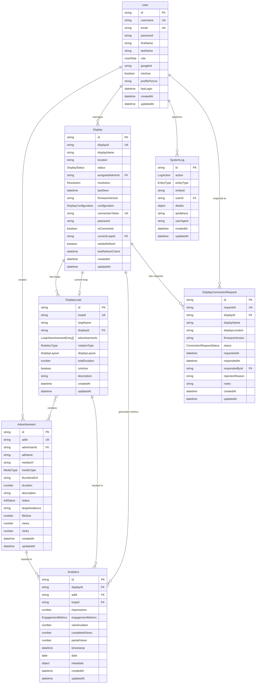

# AdMiro Entity Relationships

This document defines the relationships between all entities in the AdMiro system for ER diagram generation.

## Entities Overview

The AdMiro system has **7 primary entities**:

1. **User** - User accounts (Admin, Advertiser)
2. **Advertisement** - Digital ads (images/videos)
3. **Display** - Physical/browser display devices
4. **DisplayLoop** - Playlists of advertisements
5. **SystemLog** - Audit trail entries
6. **Analytics** - Engagement and performance metrics
7. **DisplayConnectionRequest** - Display approval requests

---

## Entity Relationships

### 1. User ↔ Advertisement
- **Relationship**: One-to-Many
- **Type**: Ownership
- **Description**: A User (Advertiser) creates and owns multiple Advertisements
- **Foreign Key**: `Advertisement.advertiserId` → `User.id`
- **Cardinality**: 
  - User (1) ──< Advertisement (Many)
- **Constraints**:
  - An Advertisement must belong to exactly one User
  - A User can have zero or more Advertisements
  - Cascade on delete: Delete advertisements when user is deleted

---

### 2. User ↔ Display
- **Relationship**: One-to-Many
- **Type**: Assignment
- **Description**: A User (Admin) can be assigned to manage multiple Displays
- **Foreign Key**: `Display.assignedAdminId` → `User.id` (optional)
- **Cardinality**:
  - User (1) ──< Display (0..Many)
- **Constraints**:
  - A Display can optionally have one assigned Admin
  - A User (Admin) can manage zero or more Displays
  - Set null on delete: Remove admin assignment when user is deleted

---

### 3. Display ↔ DisplayLoop
- **Relationship**: One-to-Many
- **Type**: Loop Assignment
- **Description**: A Display can have multiple DisplayLoops created for it, but only one active at a time
- **Foreign Keys**: 
  - `DisplayLoop.displayId` → `Display.id`
  - `Display.currentLoopId` → `DisplayLoop.id` (optional)
- **Cardinality**:
  - Display (1) ──< DisplayLoop (Many)
  - Display (1) ─── DisplayLoop (0..1) [current loop]
- **Constraints**:
  - A DisplayLoop must belong to exactly one Display
  - A Display can have multiple DisplayLoops but only one active
  - Cascade on delete: Delete loops when display is deleted

---

### 4. DisplayLoop ↔ Advertisement
- **Relationship**: Many-to-Many
- **Type**: Playlist Composition
- **Description**: A DisplayLoop contains multiple Advertisements, and an Advertisement can be in multiple DisplayLoops
- **Junction**: `LoopAdvertisementEntry` (value object embedded in DisplayLoop)
- **Cardinality**:
  - DisplayLoop (Many) ──< LoopAdvertisementEntry >── Advertisement (Many)
- **Constraints**:
  - A DisplayLoop can contain zero or more Advertisements
  - An Advertisement can be in zero or more DisplayLoops
  - Order is maintained via `LoopAdvertisementEntry.order`
  - No cascade on delete: Remove from loop when advertisement is deleted

---

### 5. User ↔ SystemLog
- **Relationship**: One-to-Many
- **Type**: Audit Trail
- **Description**: A User performs actions that generate SystemLog entries
- **Foreign Key**: `SystemLog.userId` → `User.id`
- **Cardinality**:
  - User (1) ──< SystemLog (Many)
- **Constraints**:
  - A SystemLog must be created by exactly one User
  - A User can generate zero or more SystemLog entries
  - Set to system user on delete: Don't delete logs when user is deleted

---

### 6. Display + Advertisement + DisplayLoop ↔ Analytics
- **Relationship**: Many-to-One (Composite)
- **Type**: Performance Tracking
- **Description**: Analytics tracks metrics for a specific Advertisement playing on a Display in a specific Loop
- **Foreign Keys**:
  - `Analytics.displayId` → `Display.id`
  - `Analytics.adId` → `Advertisement.id`
  - `Analytics.loopId` → `DisplayLoop.id`
- **Cardinality**:
  - Display (1) ──< Analytics (Many)
  - Advertisement (1) ──< Analytics (Many)
  - DisplayLoop (1) ──< Analytics (Many)
- **Constraints**:
  - An Analytics entry must reference one Display, one Advertisement, and one Loop
  - Multiple Analytics entries can exist for the same combination (time-series data)
  - Cascade on delete: Delete analytics when any parent entity is deleted

---

### 7. Display ↔ DisplayConnectionRequest
- **Relationship**: One-to-Many
- **Type**: Approval Workflow
- **Description**: A Display can have multiple connection requests (historical)
- **Foreign Key**: `DisplayConnectionRequest.displayId` → `Display.id`
- **Cardinality**:
  - Display (1) ──< DisplayConnectionRequest (Many)
- **Constraints**:
  - A DisplayConnectionRequest must reference exactly one Display
  - A Display can have multiple connection requests over time
  - Cascade on delete: Delete requests when display is deleted

---

### 8. User ↔ DisplayConnectionRequest
- **Relationship**: One-to-Many
- **Type**: Approval Action
- **Description**: A User (Admin) responds to DisplayConnectionRequests
- **Foreign Key**: `DisplayConnectionRequest.respondedById` → `User.id` (optional)
- **Cardinality**:
  - User (1) ──< DisplayConnectionRequest (0..Many)
- **Constraints**:
  - A DisplayConnectionRequest can optionally have one responder (Admin)
  - A User (Admin) can respond to zero or more DisplayConnectionRequests
  - Set null on delete: Keep request history when admin is deleted

---

## ER Diagram (Mermaid Syntax)

---

## Relationship Summary Table

| From Entity | To Entity | Relationship | Cardinality | Foreign Key | Delete Behavior |
|-------------|-----------|--------------|-------------|-------------|-----------------|
| User | Advertisement | One-to-Many | 1:N | Advertisement.advertiserId | CASCADE |
| User | Display | One-to-Many | 1:0..N | Display.assignedAdminId | SET NULL |
| User | SystemLog | One-to-Many | 1:N | SystemLog.userId | SET SYSTEM_USER |
| User | DisplayConnectionRequest | One-to-Many | 1:0..N | DisplayConnectionRequest.respondedById | SET NULL |
| Display | DisplayLoop | One-to-Many | 1:N | DisplayLoop.displayId | CASCADE |
| Display | DisplayLoop | One-to-One | 1:0..1 | Display.currentLoopId | SET NULL |
| Display | Analytics | One-to-Many | 1:N | Analytics.displayId | CASCADE |
| Display | DisplayConnectionRequest | One-to-Many | 1:N | DisplayConnectionRequest.displayId | CASCADE |
| DisplayLoop | Advertisement | Many-to-Many | N:M | LoopAdvertisementEntry | REMOVE FROM LOOP |
| DisplayLoop | Analytics | One-to-Many | 1:N | Analytics.loopId | CASCADE |
| Advertisement | Analytics | One-to-Many | 1:N | Analytics.adId | CASCADE |

---

## Indexes for Performance

### User
- Primary: `id`
- Unique: `username`, `email`
- Index: `googleId` (for OAuth lookups)

### Advertisement
- Primary: `id`
- Unique: `adId`
- Index: `advertiserId` (for user's ads)
- Index: `status` (for filtering active ads)

### Display
- Primary: `id`
- Unique: `displayId`, `connectionToken`
- Index: `assignedAdminId` (for admin's displays)
- Index: `status` (for online/offline filtering)

### DisplayLoop
- Primary: `id`
- Unique: `loopId`
- Index: `displayId` (for display's loops)
- Index: `isActive` (for active loops)

### SystemLog
- Primary: `id`
- Index: `userId` (for user activity logs)
- Index: `entityType, entityId` (for entity audit trail)
- Index: `createdAt` (for time-based queries)

### Analytics
- Primary: `id`
- Index: `displayId, date` (for display analytics)
- Index: `adId, date` (for ad performance)
- Index: `loopId, date` (for loop metrics)

### DisplayConnectionRequest
- Primary: `id`
- Unique: `requestId`
- Index: `displayId` (for display requests)
- Index: `status` (for pending requests)
- Index: `respondedById` (for admin responses)

---

## Notes for Implementation

1. **Soft Deletes**: Consider implementing soft deletes for User, Advertisement, and Display entities to preserve historical data in Analytics and SystemLog.

2. **Referential Integrity**: All foreign key relationships should be enforced at the database level (MongoDB references or relational DB constraints).

3. **Cascade Behavior**: 
   - **CASCADE**: Analytics, SystemLog, DisplayLoop when parent is deleted
   - **SET NULL**: Display.assignedAdminId, Display.currentLoopId when referenced entity is deleted
   - **RESTRICT**: Prevent deletion if active references exist (configurable)

4. **Data Denormalization**: Analytics may denormalize some data (ad name, display name) for faster querying without joins.

5. **Time-Series Data**: Analytics entries are immutable once created and form a time-series dataset for historical analysis.
